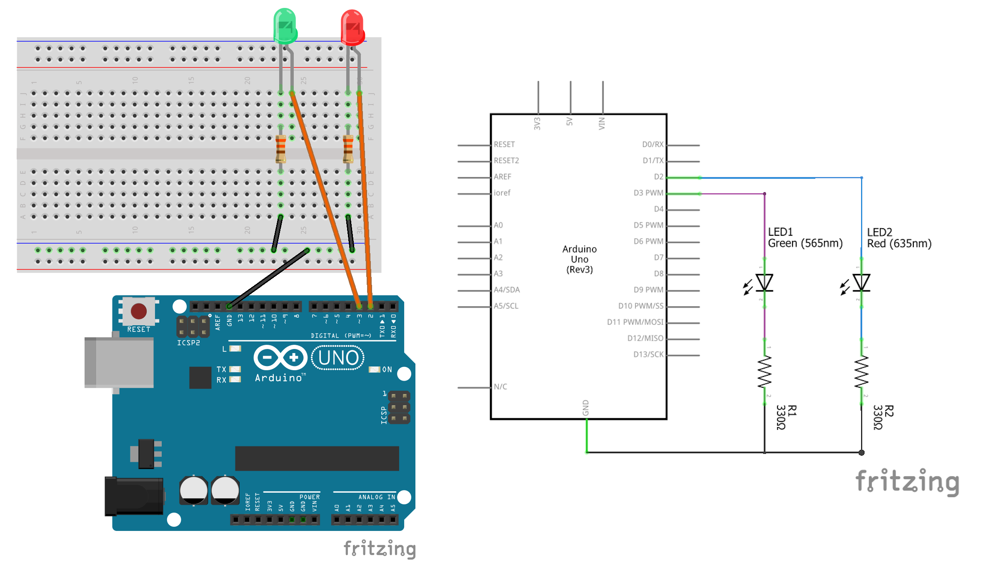

# 1. Scheduled Tasks

Periodic tasks are fairly common in Arduino programming. For example, one may want to toggle an LED at 1 second interval. In beginner's code, this is often achieved using Arduino's `delay()` function. Concretely, the `loop()` function may looks like this:

```C
void loop(){
  digitalWrite(LED_PIN, HIGH);
  delay(1000);
  digitalWrite(LED_PIN, LOW);
  delay(1000);
}
```

where `LED_PIN ` is a global variable defining the pin that output to the LED.

The issue of using `delay()` is that it is a **blocking** function. That is, during the 1 second where the delay occurs, the micro-controller completely pause its execution and there is no way to handle other tasks in the meantime.[^1]

To see the issue more clearly, suppose you are given the circuit below, and your task is:

+ The red LED should toggle at an 1 second interval.
+ The green LED should toggle at a 600 millisecond interval.
+ The green LED should first turned on at 100 millisecond AFTER the red LED is first turned on.



You **could** use `delay()` to implement the above requirement, but it would be very unwieldy. Instead, the problem is better solved using **non-blocking** loop.

## Non-blocking loop using `millis()`

*For a simpler example of non-blocking loop, see the "[Blink Without Delay](https://docs.arduino.cc/built-in-examples/digital/BlinkWithoutDelay/)" example from the official Arduino documentation, which is an original inspiration of this repo.*

The basic idea of `millis()` based non-blocking loop is this: instead of using `delay()`, we set a timestamp for the next time an action needs to be taken. On each loop, we check if the current time has passed the timestamp, and if so we execute the action and set a new timestamp.

Thus, the code snippet to toggle the red LED may looks like the following:

```
void loop() {

  // get the current time
  unsigned long now = millis();

  // run if the current time has passed the timestamp for red LED
  if (now > timestamp_1){

    // code block that toggle the red LED
    if (red_state == 0){
      digitalWrite(RED_PIN, HIGH);
      red_state = 1;
    } else {
      digitalWrite(RED_PIN, LOW);
      red_state = 0;
    }

    // update timestamp
    timestamp_1 += (unsigned long) timeout_1; 
  }

  /*
    * Codes to toggle green LED
    */
}
```

Here `red_state` is a global variable that tracks if the red LED is on or off, while `timeout_1` = 1000 is the timeout between toggles for the red LED.

The code snippet to toggle the green LED can be similarly written, using `timestamp_2` instead of `timestamp_1`, `GRN_PIN` instead of `RED_PIN`, `grn_state` instead of `red_state`, and `timeout_2` = 600 instead of `timeout_1`.

Finally, how to make sure the green LED starts 100 ms later than the red LED? Well, the two timestamps have to be set somewhere, most likely in the `setup()` part of the code, and we can set the initial timestamp to differ by 100 ms. Concretely,

```
void setup(){

  /*
    * Other setup codes
    */

  unsigned long now = millis();

  // set the first toggling of red LED
  timestamp_1 = now + (unsigned long) tinit_1;

  // set the first toggling of green LED
  timestamp_2 = now + (unsigned long) tinit_2;

}
```

where `tinit_1` = 0 while `tinit_2` = 100.

For the full functioning code, see the "[schedule_by_hand.ino](../examples/schedule_by_hand/schedule_by_hand.ino)" sketch from the examples folder.

## Non-blocking periodic tasks using the `SimpleEvents` class

While the above approach works, when you need to manage a large number of periodic tasks, the codes will become somewhat hard to digest. Also, repeating the same code snippet over and over with minimal change is a lot of redundant typing and can be a source of bugs (just imagine you forgot to replace one of the timestamp variable when you copy and paste your code).

The way out is to _abstract_ away the repetitive code structure and _encapsulate_ it in a class. This is what the `SimpleEvents` class from the `simpleEvents.h` header file do for you.

To use this strategy, you'll need to place the codes that execute within the `if (now > timestamp)` branch into separate functions, so we define:

```
// function that toggles the red LED on and off
void toggle_red(){
  if (red_state == 0){
    digitalWrite(RED_PIN, HIGH);
    red_state = 1;
  } else {
    digitalWrite(RED_PIN, LOW);
    red_state = 0;
  }
}

// function that toggles the green LED on and off
void toggle_grn(){
  if (grn_state == 0){
    digitalWrite(GRN_PIN, HIGH);
    grn_state = 1;
  } else {
    digitalWrite(GRN_PIN, LOW);
    grn_state = 0;
  }
}
```

Note that you **do not** set any new timestamp in these functions, since that part is taken care of by the `SimpleEvents` class itself.  Moreover, all the above functions are required to **take no arguments** and **return nothing**.

Of course, you'll need to load the required library and create an instance of `SimpleEvent`. So the top of your sketch will look something like:[^2]

```
#include <simpleEvents.h>

SimpleEvents<> mainloop;
```

Then, in the `setup()` part of the sketch, you'll need to tell `mainloop` to schedule in the two periodic tasks, and then start the clock ticking, like so:

```
void setup(){

  /*
   * More setup codes
   */

  // schedule the toggling of red LED
  mainloop.addSchedule(toggle_red, timeout_1, tinit_1); 

  // schedule the toggling of green LED
  mainloop.addSchedule(toggle_grn, timeout_2, tinit_2);

  // create the initial timestamp
  mainloop.begin();
}
```

Here the first `.addSchedule()` line tells `mainloop` to schedule the `toggle_red` function to run every `timeout_1` millisecond, with an initial delay of `tinit_1` millisecond. The second  `.addSchedule()` line can be similarly interpreted (yes, functions can take another function as an argument;[^3] and yes, only the *function name* goes into the argument, e.g., it is `toggle_red` and not `toggle_red()`).

Then, in the `loop()` part of the sketch, you simply tell `mainloop` to run once every loop so that it will execute at the desired time, like so:

```
void loop(){
  mainloop.run();
}
```

For the full functioning code, see the "[schedule_simpleEvents.ino](../examples/schedule_simpleEvents/schedule_simpleEvents.ino)" sketch from the examples folder. In the same folder you can also find a [variation](../examples/schedule_simpleEvents_asym/schedule_simpleEvents_asym.ino) for which the red LED flashes on for 200 milliseconds at 1 second interval.

Now that you've seen how `SimpleEvents` help you manage periodic task, continue to the "[2. Reactions and Debounce](2_reactions_and_debounce.md)" tutorial to see how it helps you deal with tasks that are triggered.

[^1]: *For the experts*: Technically you can still use interrupts, so execution is not *completely* blocked. That said, given the limitations of interrupts, non-blocking code based on still the more appropriate solution.
    
[^2]: You may not have seen variable declaration that has angle brackets `<>` before. There is a technical reason for their existence here. You can learn more in the "[3. advanced features](4_advanced_features.md)" tutorial.
    
[^3]: *For the experts*: Technically a C/C++ function can take the **pointer** of another function as an argument. The code above works because the function name is automatically translated to its address. As the Arduino [API Style Guide](https://docs.arduino.cc/learn/contributions/arduino-library-style-guide/) stipulates, I am avoiding `&` and `*` whenever I can.
