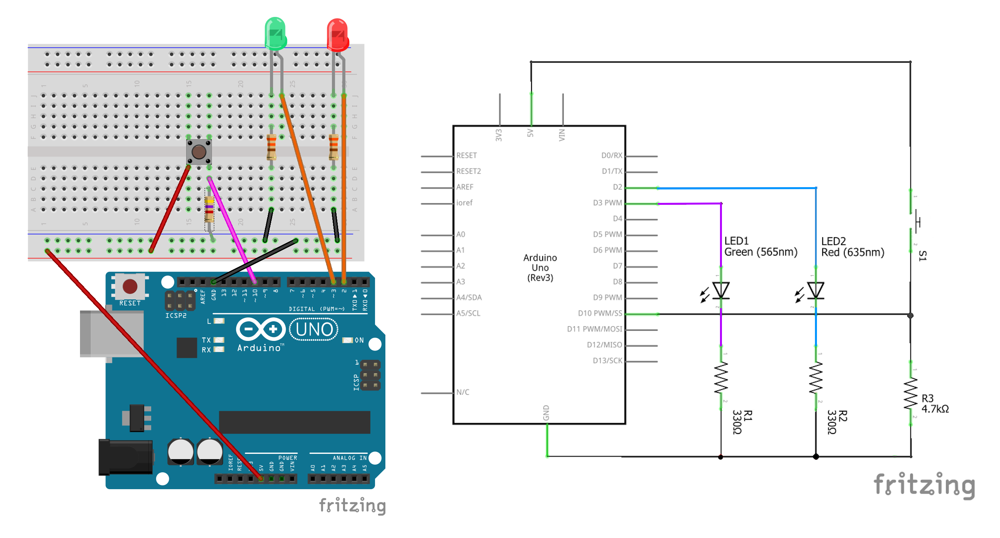

# 2. Reactions and Debounce

## Blocking versus non-blocking reaction

Instead of scheduling a task to run periodically, sometimes you want to schedule a task to run when triggered. As an example, consider the circuit below (which is just the circuit for "[schedule_simpleEvents.ino](../examples/schedule_simpleEvents/schedule_simpleEvents.ino)" with an addition of a push button).



Suppose we want the circuit to behave as follows:

+ Normally, both LEDs are off.
+ Once the button is pushed, the red LED immediately turns on.
+ Two seconds after the red LED got turned on, the red LED is turned off and the green LED is turned on.
+ Two seconds after the green LED is turned on, it is turned back off again.

As with the case of periodic tasks, a beginner's solution would involve using `delay()`, something like this in the `loop()` function:

```
void loop(){

  // execute if the button is pushed
  if (digitalRead(BUTTON_PIN)==HIGH){

    // immediately turn on the red LED
    digitalWrite(RED_PIN, HIGH);

    // wait for 2 seconds after red LED got turned on
    delay(2000);

    // then turn off the red LED and turn on the green one
    digitalWrite(RED_PIN, LOW);
    digitalWrite(GRN_PIN, HIGH);

    // wait for 2 seconds after green LED got turned on
    delay(2000);

    // then turn off the green LED
    digitalWrite(GRN_PIN, LOW);
  }

}
```

(You can see the full functioning code in the "[reaction_blocking.ino](../examples/reaction_blocking/reaction_blocking.ino)" sketch). As with the case of periodic tasks, the main *shortcoming* of this solution is that the execution of the loop is **blocked** whenever the delay is in effect, so it will be difficult to handle multiple button inputs at the same time.

Instead, let's implement the desired behavior using non-blocking loop based on `millis()`. The key idea is this: once we detect a key press, in addition to turning on the red LED, we activate two timestamps, the first one controls the turning on of the green LED and the turning off of the red LED, while the second one controls the subsequent turning off of the green LED.

In that way, the `loop()` part of the code now looks like:

```
void loop() {

  // get the current time
  unsigned long now = millis();

  // execute if the button is pushed
  if (digitalRead(BUTTON_PIN)==HIGH){

    // turn on the red LED
    digitalWrite(RED_PIN, HIGH);

    // set the timestamps for action 2 and 4 seconds into future
    time_flip = now + 2000;
    time_flop = now + 4000;

    // set flag indicating that actions are pending
    flip_trigger = true;
    flop_trigger = true;
  }

  // execute "flip" if action is pending and time has passed
  if (flip_trigger && now > time_flip){

    // turn off the red LED and turn on the green LED
    digitalWrite(RED_PIN, LOW);
    digitalWrite(GRN_PIN, HIGH);

    // set flag indicating that action is no longer pending
    flip_trigger = false;
  }

  // execute "flop" if action is pending and time has passed
  if (flop_trigger && now > time_flop){

    // turn off the red LED and turn on the green LED
    digitalWrite(GRN_PIN, LOW);

    // set flag indicating that action is no longer pending
    flop_trigger = false;
  }

}
```

Here `time_flip`, `time_flop`, `flip_trigger` and `flop_trigger` are global variables, with `time_flip`, `time_flop` initialzied to `0`, while `flip_trigger `and `flop_trigger `are initialized to `false`.

For full functioning code see the "[reaction_by_hand.ino](../examples/reaction_by_hand/reaction_by_hand.ino)" sketch under the examples folder. You'll notice that in addition to setting the two timestamp (`time_flip` and `time_flop`), when the button is pressed we also set the two flags (`flip_trigger` and `flop_trigger`) to `true`, and these are set back to `false` after the corresponding code is run. In that way, we ensure that the switch toggling only happen once per triggering event.

## Non-blocking reaction using the `SimpleEvents` class

As with periodic tasks, the `SimpleEvents` class also provides abstraction for reactions (which is the name we give to code that execute on trigger). The main change here is that we need to use the `.addReaction()` method instead of the `.addSchedule()` method.

As before, we again need to put the code that execute on triggers into functions. But this time we also need to put the code that **check the trigger** into functions. So we need:

```
// function that check if the button is pressed
bool check_button(){

  if (digitalRead(BUTTON_PIN)==HIGH){
    return true;
  } else {
    return false;
  }
}

// function that turns the red LED on
void turn_on_red(){
  digitalWrite(RED_PIN, HIGH);
}

// function that turns red LED off and green LED on
void switch_red_green(){
  digitalWrite(RED_PIN, LOW);
  digitalWrite(GRN_PIN, HIGH);
}

// function that turns the green LED off
void turn_off_green(){
  digitalWrite(GRN_PIN, LOW);
}
```

Note that `check_button()` is **required** to **take no arguments** and **return a boolean value**, i.e., either `true` or `false`.

Next, in the `setup()` part of the code, we register `turn_on_red()` to run immediately after button press, `switch_red_green()` to run 2000 milliseconds after button press, and `turn_off_green()` to run 4000 milliseconds after button press (recall that we need to put in the *function name*, without the parentheses):

```
void setup(){
  /*
   * More setup codes
   */

  // turning on the red RED on button press, no delay
  mainloop.addReaction(check_button, turn_on_red, 0, 0);

  // turning OFF the red RED and turning on the green LED
  // both scheduled to run 2000 milliseconds after button press
  mainloop.addReaction(check_button, switch_red_green, 0, 2000);

  // turning OFF the green LED
  // scheduled to run 4000 milliseconds after button press
  mainloop.addReaction(check_button, turn_off_green, 0, 4000);

  // create the initial timestamp
  mainloop.begin();
}
```

Finally, the `loop()` of the code consists of a single `mainloop.run()` method call, just like in "[schedule_simpleEvents.ino](../examples/schedule_simpleEvents/schedule_simpleEvents.ino)".

For the full functioning code, see the "[reaction_simpleEvents.ino](../examples/reaction_simpleEvents/reaction_simpleEvents.ino) sketch under the examples folder.

## Debouncing

There is actually a subtle difference between the blocking code and the non-blocking ones. For example, if you **press and hold** the button, the blocking code will cycle through the red and green LEDs as usual, while the non-blocking code will remain in the "red on, green off" state until you release the button.

In fact, the situation is even worse for the non-blocking codes. Specifically, if you press (but not hold) the button a second time when the green LED is on, you will get into a "red on, green on" state that the specification have not mentioned at all! Thus, not only is our non-blocking codes different from the blocking one, it is also buggy.

What we need here is an implementation of **debouncing**. Basically, you want to pause the button check for the duration of the LED cycle (4000 milliseconds). Thankfully, debouncing is built-in to the `SimpleEvents` class. Specifically, the third argument of `.addReaction()` (which so far we have set to `0`) specifies the duration of the debounce, so all we need to do is to change the `setup()` part of the code like so (note that the debounce duration is count from the time when *the trigger is pulled*, i.e., when the push button is pressed in this case):

```
void setup(){
  /*
   * More setup codes
   */

  // turning on the red LED on button press, no delay
  // set a debounce duration of 4000 milliseconds (timed from button press)
  mainloop.addReaction(check_button, turn_on_red, 4000, 0);

  // turning OFF the red LED and turning on the green LED
  // both scheduled to run 2000 milliseconds after button press
  // set a debounce duration of 4000 milliseconds (timed from button press)
  mainloop.addReaction(check_button, switch_red_green, 4000, 2000);

  // turning OFF the green LED
  // scheduled to run 4000 milliseconds after button press
  // set a debounce duration of 4000 milliseconds (timed from button press)
  mainloop.addReaction(check_button, turn_off_green, 4000, 4000);

  // create the initial timestamp
  mainloop.begin();
}
```

The full functioning code for the debounced case can be found in the "[debounced_simpleEvents.ino](../examples/debounced_simpleEvents/debounced_simpleEvents.ino)" sketch under the examples folder.

In case you wonder how debouncing works without using `SimpleEvents`. The basic idea is that we need **yet another** timestamp (call it `time_debounce`). We ask the micro-controller to check for button press only when the current time has pass this timestamp, and we increment this timestamp to 4000 milliseconds after the current time whenever we detect the button press when debouncing is off.

In terms of code, all we have to do is to change the `if (digitalRead(BUTTON_PIN)==HIGH){...}` block in the "[reaction_by_hand.ino](../examples/reaction_by_hand/reaction_by_hand.ino)" to:

```
void loop(){

  // get the current time
  unsigned long now = millis();

  // execute if the button is pushed
  if (now > time_debounce && digitalRead(BUTTON_PIN)==HIGH){

    // turn on the red LED
    digitalWrite(RED_PIN, HIGH);

    // set the debounce to end 4000 milliseconds after current time
    time_debounce = now + 4000;

    // set the timestamps for action 2 and 4 seconds into future
    time_flip = now + 2000;
    time_flop = now + 4000;

    // set flag indicating that actions are pending
    flip_trigger = true;
    flop_trigger = true;
  }

  /*
   * More codes to execute per loop
   */

}
```

Of course, we'll also need to declare and initialize `time_debounce` variable (in this simple case, it suffices to set it to `0` when declared). For the full functioning code, see the  "[debounced_by_hand.ino](../examples/debounced_by_hand/debounced_by_hand.ino)" sketch in the examples folder.

While `.addSchedule()` and `.addReaction()` covers the main use case of the non-blocking event loops, the `SimpleEvents` class (and its sibling the `TinyEvents` class) also have a few more advanced features, which will be covered in "[3. Advanced Features](3_advanced_features.md)"
