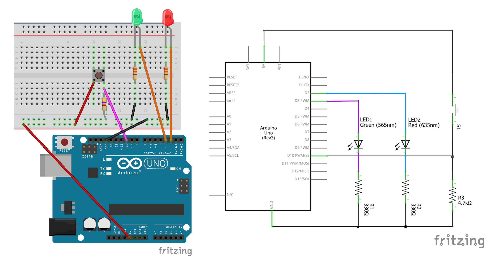

# 3. Advanced Features

## Before we start....

Since this tutorial is on the *advanced* features of the `SimpleEvents` and `TinyEvents` class, I assume the audience to be more experienced, e.g., not afraid of digging into the source codes of Arduino sketches. Consequently, I will say less in the tutorial proper and let the Arduino sketches speak for themselves.

For the basics, consult the tutorials "[1. Scheduled Tasks](1_scheduled_tasks.md)" and "[2. Reactions and Debounce](2_reactions_and_debounce.md)".

All the codes in this tutorial (and in the previous tutorials) can be run on the same physical circuit shown below:



In most cases, the desired circuit behavior is (let's call this the *default behavior* henceforth):

+ Green LED toggle between on and off at 1 second interval.
+ Once the button is pushed, the red LED immediately turns on.
+ Two seconds after the red LED got turned on, the red LED is turned off.

(There are two additional circuit behaviors in the examples below).

## Using both reactions and schedules

You have seen example where a `SimpleEvents` instance manages multiple schedules at the same time, as well as examples where it manages multiple reactions at the same time. Not surprisingly, a `SimpleEvents` instance can also manage **both** at the same time. For an example, see the "[both_schedule_reaction.ino](../examples/both_schedule_reaction/both_schedule_reaction.ino)" sketch.

## Running codes alongside a `SimpleEvents` instance

So far in all of our examples the `loop()` part of the Arduino sketch consists of a single statement:

```C
void loop(){
    mainloop.run();
}
```

Given that `SimpleEvents` is non-blocking, it is totally fine to add additional codes before or after the `mainloop.run()` statement.[^1] As an example, we implement the *default behavior* partly by hand and partly using the `SimpleEvents` class in the "[both_schedule_reaction_mixed.ino](../examples/both_schedule_reaction_mixed/both_schedule_reaction_mixed.ino)" sketch.

Incidentally, this means that you can create and use *multiple instances* of the `SimpleEvents` class in the same sketch. You just have to make sure that the `.begin()` method is called once for both instances, and that you include the `.run()` method for each instance within the `loop()` of the sketch.[^2]

## Pausing and resuming

The `SimpleEvents` class is there to manage periodic tasks and reactions, and sometimes you need to "manage the manager." As a concrete example, let's say you use `.addSchedule()` to create a flashing LED. There are circumstances where you may want to stop the LED from flashing, thus keeping it in either perpetual on or perpetual off state.

To that end, `SimpleEvents` provides a pair of methods named `.pauseSchedule()` and `.resumeSchedule()` to control the pausing and resumption of a scheduled task.

Since a `SimpleEvents` instance can manage multiple schedules, you'll need to specify which one to pause/resume when you use `.pauseSchedule()` and `.resumeSchedule()`. The identifier (a.k.a. ID) for a particular schedule is simple: it is the order it got added to the `SimpleEvents` instance, except that (like array indices) the count starts from 0. Thus, the schedule created by the first `.addSchedule()` call has ID 0, the schedule created by the second `.addSchedule()` call has ID 1, and so on.

As a simple example, let's say you have a flashing LED managed by schedule #0, and you want the flashing to pause between `millis()` = 5000 and `millis()` = 10000. Then, the `loop()` portion of your Arduino sketch may looks like the following:

```C
void loop() {

  // get the current time
  unsigned long now = millis();

  // execute when the current time is pass 5000 and we have not yet paused
  if (to_pause && now > 5000){

    // start pausing the schedule with ID 0
    mainloop.pauseSchedule(0);

    to_pause = false; // indicate that we no longer need to issue pause
  } 

  // execute when the current time is pass 10000 and we have not yet resumed
  if (to_resume && now > 10000){

    // resume the schedule with ID 0
    mainloop.resumeSchedule(0);

    to_resume = false; // indicate that we need not issue more resumes
  }

  mainloop.run();

}
```

where `to_pause` and `to_resume` are two global variables initialized to `true`. For the full functioning code, see the "[pause_resume_schedule_timed.ino](../examples/pause_resume_schedule_timed/pause_resume_schedule_timed.ino)" sketch.

While instructive, the above example is not very useful. More often, you would want to implement pausing and resuming **on user input**, say through a push button. Given that a `SimpleEvents` instance can handle button push via `.addReaction()`, it suggests that we can handle the pausing and resuming of a schedule **using a reaction**. What we need to do is to include `.pauseSchedule()` and `.resumeSchedule()` in the reaction (which we named `toggle_schedule()` in this case), like so:

```C
void toggle_schedule(){

  if (button_parity == 0){

    /* if the new button push is an odd-number push, pause the flashing of
     * the green LED 
     */
    mainloop.pauseSchedule(0);

    // indicating that the button has now been pushed odd number of times
    button_parity = 1;

  } else {

    /* if the new button push is an even-number push, pause the flashing of
     * the green LED
     */
    mainloop.resumeSchedule(0);

    // indicating that the button has now been pushed even number of times
    button_parity = 0; 
  }
}
```

where `button_parity` is a global variable initialized to `0`. We can then add the reaction and the schedule as usual:

```C
void setup() {

  pinMode(GRN_PIN, OUTPUT);
  digitalWrite(GRN_PIN, LOW);

  // turn off the toggling of green LED if button is pressed odd times
  // turn on the toggling of green LED if button is pressed even times
  // set a debounce duration of 250 milliseconds to account for reaction time
  mainloop.addReaction(check_button, toggle_schedule, 250, 0);

  // schedule the toggling of green LED
  // This is the first SCHEDULE added, so its ID is still 0
  mainloop.addSchedule(toggle_green, 500);

  // create the initial timestamp
  mainloop.begin();

}

void loop() {
  mainloop.run();
}
```

For the full functioning code (which, among other things, defined `toggle_green()` and `check_button()`), see the "[pause_resume_schedule.ino](../examples/pause_resume_schedule/pause_resume_schedule.ino)" sketch.

Similar to schedules, the `SimpleEvents` class provides `.pauseTrigger()` and `.resumeTrigger()` methods to control whether the trigger of a reaction is checked. In addition, when the delay of a reaction (the value in the *fourth* argument of `.addReaction()`) is positive, a pending reaction can be cancelled with the `.cancelReaction()` methods. Just like the corresponding methods for schedules, you need to supply a reaction ID to the above methods, and the ID is the order for which the reaction is added, counting from 0.

An interesting example for using `.pauseTrigger()`, `.resumeTrigger()`, `.cancelReaction()` is to consider a variation of "[debounced_simpleEvents.ino](../examples/debounced_simpleEvents/debounced_simpleEvents.ino)" where, after a first button press and when the LED sequence is in progress, a second button press can be used to cancel the LED sequence. The concrete circuit behavior we want is:

+ Normally, both LEDs are off.
+ Once the button is pushed, the red LED immediately turns on.
+ Two seconds after the red LED got turned on, the red LED is turned off and the green LED is turned on.
+ Two seconds after the green LED is turned on, it is turned back off.
+ If the button is pushed a second time when the LED sequence is in progress, the LED sequence is stopped and all LEDs are turned off.

To do so, we need a `SimpleEvents` instance with **four** reactions:

+ Reaction #0 handle the second button push event (callback = `cancel_reset_LEDs()`).
+ Reaction #1 immediately turns on red LED (callback = `turn_on_red()`).
+ Reaction #2 turn off the red LED and turn on the green LED on 2 seconds delay (callback = `switch_red_green()`).
+ Reaction #3 turn off the green LED (callback = `turn_off_green()`).

We need reaction #0 to be active **only** between the execution of reaction #1 and #3, so we need to modify `turn_on_red()` and `turn_off_green()` like so:

```C
// function that turns the red LED on
void turn_on_red(){
  digitalWrite(RED_PIN, HIGH);
  
  // allow a second button press to trigger `cancel_reset_LEDs()`
  // after a 250 millisecond debounce for human reaction time
  mainloop.resumeTrigger(0, 250);
}

/*
 * More function definitions 
 */

// function that turns the green LED off
void turn_off_green(){
  digitalWrite(GRN_PIN, LOW);
  
  /* the LED sequence has ended, so the trigger for `cancel_reset_LEDs()`
   * should now be off.
   */
  mainloop.pauseTrigger(0);
}
```

Also, when the button is pressed a second time, `turn_on_red()`, `switch_red_green()`, and `turn_off_green()` should be ready for trigger again, while `cancel_reset_LEDs()` should be off. So we need:

```C
// function to cancel pending actions in the LED sequence, and reset the LEDs
void cancel_reset_LEDs(){
  
  /* The LED sequence has reset, so the trigger for `cancel_reset_LEDs()`
   * should now be off
   */
  mainloop.pauseTrigger(0);
  
  // cancel the reactions associated with the LED sequence
  // also reset all of the associated debounce to end in 250 milliseconds
  /* NOTE: the 250 milliseconds debounce is needed to account for human
   * reaction time in releasing the button.
   */
  mainloop.cancelReaction(1, true, 250);
  mainloop.cancelReaction(2, true, 250);
  mainloop.cancelReaction(3, true, 250);
  
  // turn off both LEDs to return LED state to before button press
  /* NOTE that in general, resetting state requires additional action then just
   * calling `cancelReaction()`
   */
  digitalWrite(RED_PIN, LOW);
  digitalWrite(GRN_PIN, LOW);

}
```

For the full functioning code (which, among other things, defined `toggle_green()` and `check_button()`), see the "[cancel_reaction.ino](../examples/cancel_reaction/cancel_reaction.ino)" sketch.

## Serial debugging interface

One common way to debug Arduino sketches is to print out debugging messages using the `Serial` interface. The `SimpleEvents` class have built-in support for that, you just need to modify your sketch in two places.

First, **before** you import the `simpleEvents.h` header file, make sure you add a line that `#define` a symbol called `SIMPLE_EVENTS_VERBOSE`. Concretely, the top of your sketch may look like this:

```C
#define SIMPLE_EVENTS_VERBOSE 1

#include <simpleEvents.h>
```

Second, make sure that the serial interface is ready by calling `Serial.begin()` early on in the `setup()` part of your sketch:

```C
void setup(){
  /* Important: for debugging via `Serial` to work the Serial interface
   * needs to be initialized in the `setup()` portion of the sketch.
   */
  Serial.begin(9600);

  /*
   * More setup codes
   */
}
```

For an example, see the "[both_schedule_reaction_debug.ino](../examples/both_schedule_reaction_debug/both_schedule_reaction_debug.ino)" sketch, which implements the default circuit behavior but with added serial output.

## Specifying the "size" of an `SimpleEvents` instance

If you are sharp eyed and sharp minded, our examples of `SimpleEvents` may leave a few questions in you:

+ Can we keep adding more and more schedules and reactions? Is there a limit?
+ Why do we declare instances of `SimpleEvents` with the angle brackets (as in `SimpleEvents<> mainloop`)
+ Why are the global variable memory footprints of the "..._simpleEvents.ino" sketches larger than the corresponding "..._by_hand.ino" sketches?

The answers to all these questions are related. Specifically, when you declare `SimpleEvents<> mainloop`, the compiler for your micro-controller has to allocate memory to hold all the internal timestamps, flags, etc.

The default (which corresponds to the empty angle brackets, `<>`) is to set aside enough memory for you to add **8 schedules and 8 reactions**. This is a compromise that gives a typical user enough room to build useful sketches, while at the same time keep the global variable memory usage modest (so that you can `#include` other libraries that control motors, read temperature, etc.).

Since our examples use far fewer schedules and reactions than the default limit, there are memory spaces that are allocated but never used, which is why the "..._simpleEvents.ino" sketches generally use more memory than the "..._by_hand.ino" sketches.

In situation where you use a lot of external libraries, you may need to constraint the memory footprint of `SimpleEvents`, and when you have a *lot* of tasks to manage, you may want to give `SimpleEvents` more room. Both can be achieved by initializing the `SimpleEvents` instance with non-default values. For example, if we instead have:

```C
SimpleEvents<16,12> mainloop
```

Then the `mainloop` will have enough space to hold 16 schedules and 12 reactions. In general, you should either take the default or specify *both* the number of schedules and reactions that you want your instance to hold.

As an example, to achieve the default circuit behavior we need only 1 schedule and 2 reactions. So a declaration of `SimpleEvents<1,2> mainloop` should be sufficient for the sketch to run. You can check that this is indeed the case with the "[both_schedule_reaction_tight.ino](../examples/both_schedule_reaction_tight/both_schedule_reaction_tight.ino)" sketch. On my Arduino Uno rev 3, the memory footprint reduces to 73 bytes compared to the default case of 281 bytes.

## Using `TinyEvents` class to further reduce memory footprint

In cases where you are **really** short on memory, and if your micro-controller is 8-bit,[^3] you can squeeze out a bit more space by using the `TinyEvents` class[^4] rather than the `SimpleEvents` class. The `TinyEvents` class is defined in `tinyEvents.h` rather than `simpleEvents.h`, so the top of your sketch may look like:

```C
/* We want to use the "TinyEvents" class, so we include "tinyEvents.h"
 * instead of "simpleEvents.h"
 */
#include <tinyEvents.h>

// Make an instance of TinyEvents as opposed to SimpleEvents
// one schedule, two reactions
// store time interval for scheduled tasks in 16-bit unsigned integer
// store debounce and delay time for reactions in 16-bit unsigned integer
TinyEvents<1, 2, uint16_t, uint16_t> mainloop;
```

Note that we have to customize the `TinyEvents` instance with **four** parameters. The first two are the same as in the `SimpleEvents` case: the first number is the number of schedules to hold, and the second is the number of reactions to hold. The third and fourth parameters tell the compiler what *type* of variables to use for holding certain internal data, and the idea is to use the **smallest** type you can get away with.

In particular, the third argument (the first `uint16_t`) specifies the type of variable to use for holding the time intervals between scheduled tasks. The `uint16_t` stands for 16-bit unsigned integer, and it is good for intervals up to $2^{16} - 1$ = 65535 milliseconds. For longer time you'll need to revert to `uint32_t` (which is equivalent to `unsigned long` in 8-bit micro-controllers). Similarly, the fourth argument specifies the type of variable to use for holding the delay and debounce of reactions. In most cases, you will be able to get by with the  `uint16_t` here.

For an example of using the `TinyEvents` class, see the "[both_schedule_reaction_tiny.ino](../examples/both_schedule_reaction_tiny/both_schedule_reaction_tiny.ino)" sketch, which (again) implements the default circuit behavior. On my Arduino rev 3, the global variable footprint is reduced to 55 bytes, compare to 73 bytes when using `SimpleEvents<1,2>`.

The methods available to the `TinyEvents` class mostly resemble that of the `SimpleEvents` class, with the exception that the `pause...` and `resume...` methods are no longer available. Instead, you control the timing of the next scheduled execution and the next trigger check by directly entering a timestamp, using the methods `.setNextSchedule()` and `.setNextTrigger()`. To "pause" a schedule, you call `.setNextSchedule()` and put in the largest possible timestamp (for 8-bit controller this is $2^{32} - 1$ = 4294967295). As examples, see the "[pause_resume_schedule_tiny.ino](../examples/pause_resume_schedule_tiny/pause_resume_schedule_tiny.ino)" sketch and the "[cancel_reaction_tiny.ino](../examples/cancel_reaction_tiny/cancel_reaction_tiny.ino)" sketch

[^1]: However, you'll want the remaining code in the `loop()` to be void of `delay()`.
    
[^2]: However, there is generally no reason to do so. See the [Specifying the &amp;#34;size&amp;#34; of a SimpleEvents instance](3_advanced_features.md#specifying-the-size-of-an-simpleevents-instance) section for more.
    
[^3]: An example is the Arduino Uno rev 3; A *counterexample* is the Arduino Uno rev 4 (both wifi and minima versions). Note that technically you can use `TinyEvents` on any micro-controller, but the memory saving is less certain and you may hit some performance issues if the micro-controller is not 8-bit.
    
[^4]: So named because I have the [ATtiny85](https://learn.sparkfun.com/tutorials/tiny-avr-programmer-hookup-guide/attiny85-use-hints) micro-controller in mind when I wrote it.
